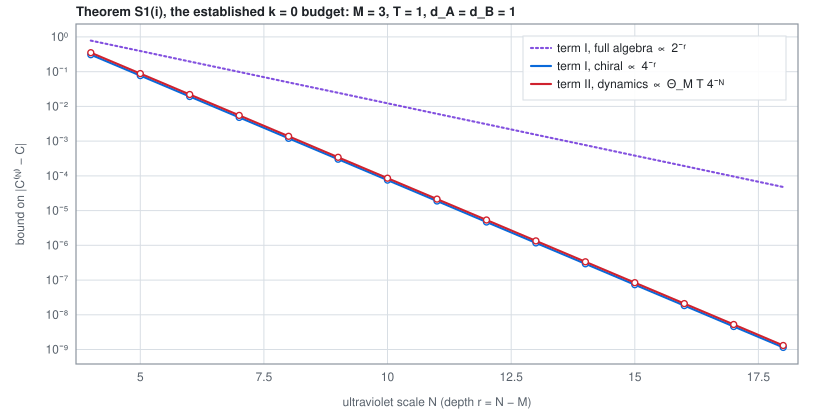
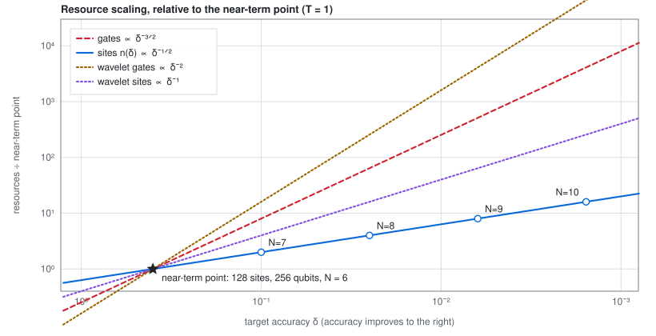
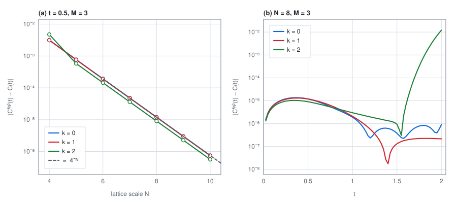
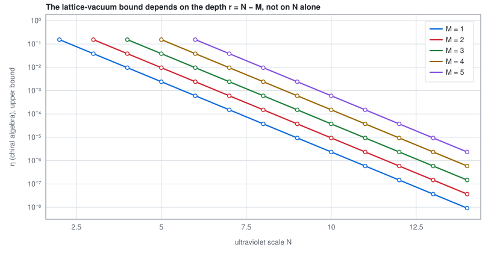

# Quantum simulation of conformal field theory

A quantum algorithm for simulating the dynamics of a 1+1-dimensional conformal field theory,
including the action of its **local conformal transformations**, together with a full analysis
of the errors and an explicit count of the resources it costs. The construction rests on
*operator-algebraic renormalization*, which builds the continuum theory as a controlled limit of
lattice models, and on the Koo–Saleur formula, which realises the Virasoro generators on the
lattice. The worked case is free fermions of central charge `c = 1/2` in the Ramond and
Neveu–Schwarz sectors, the basis of the Ising conformal field theories and of Wess–Zumino–Witten
currents.

The headline numbers, all derived in the Supplemental Material rather than asserted:

| | |
|---|---|
| cost to reach accuracy `δ` | `δ^{-3/2}`, the Heisenberg-limited measurement cost `δ^{-1}` times a discretization cost `δ^{-1/2}` |
| discretization error | `1/n²` in the number `n` of lattice sites, uniformly on a bounded time horizon |
| near-term point | accuracy `δ = 1/2` on a lattice of **128 sites**, that is **256 logical qubits**, at ultraviolet scale `N = 6` |

**[→ the interactive presentation](https://alexander-stottmeister.github.io/quantum-simulation-of-cft/)**
recomputes every consequential result live in the browser, from the same formulas the
Supplemental Material proves. The error budget and the resource curves are the two to look at
first.

## What this is: an AI-assisted, experimental open-science project

This repository is an **experiment in open science, and the 2026 revision of this manuscript is
AI-assisted.** The revision, its error analysis, its resource accounting and the numerics behind
every figure were produced by the authors working with Anthropic's Claude as an interactive
assistant, and the working record is published alongside the result rather than discarded: the
generator of every figure, the version submitted in 2022, and an honest account of which
statements are proved and which are assembled.

**Human verification is ongoing.** Nothing here has been refereed. Read every statement as a
claim under active verification, not as a settled result, and check anything you intend to rely
on against the cited sources yourself. Direction, mathematical judgement and final
responsibility are the authors'.

## The documents

No PDF is tracked: each is built from the sources beside it, and the copies below are produced by
the repository's own workflow on every push.

| document | what it is | read |
|---|---|---|
| the Letter | 7 pp. The algorithm, the complexity, and the near-term estimate. | [PDF](https://alexander-stottmeister.github.io/quantum-simulation-of-cft/pdf/qscft_main.pdf) · [source](paper/qscft_main.tex) |
| Supplemental Material | 15 pp. The discretization error analysis, the resource accounting and the ground-state circuit, and the numerical convergence data. | [PDF](https://alexander-stottmeister.github.io/quantum-simulation-of-cft/pdf/qscft_supp.pdf) · [source](paper/qscft_supp.tex) |
| the 2022 submitted version | 7 + 3 pp, for provenance: what the revision changed is visible against it. | [source](paper/2022-submitted/) |

The citable form of this manuscript is the arXiv version, [arXiv:2109.14214](https://arxiv.org/abs/2109.14214).
Cite this repository by URL and commit for anything that exists only here, and say that it has
not been refereed.

## What is established, and what is assembled

This is the section to read before relying on anything.

- **Established, and proved elsewhere.** The quantitative inputs of the error analysis come from
  the revised version of the companion paper: sharp one-particle convergence rates along the
  momentum-cutoff renormalization group, scale-uniform Virasoro energy bounds for the lattice
  generators, essential self-adjointness of the smeared generators, and an explicit
  correlator-level error bound with all constants **for the chiral Hamiltonian evolution**,
  `k = 0`. Theorem S1(i) of the Supplemental Material is that bound.
- **Assembled here, and not refereed.** Theorem S1(ii), the corresponding bound for the local
  conformal transformations `k ≠ 0`, is put together in the Supplemental Material from those
  inputs, through second quantization, the lattice vacuum, the unbounded Heisenberg dynamics and
  a multi-point telescoping. The rate and the dependence on the horizon and on the number of
  points are what that argument establishes; **the numerical value of the prefactor is not
  computed.**
- **Numerical, not proved.** The convergence data are exact computations on finite lattices, not
  proofs of an asymptotic statement. Each figure says which quantity it evaluates.
- **A caveat we keep in view.** The near-term estimate is read off one-particle data for a
  Daubechies D10 wavelet at observation scale `M = 3`. The localization constraint that ties the
  observation scale to the wavelet order is not met at that point, so the observables there are
  wavelet details wrapped around the circle rather than strictly localized fields. The register
  size is unaffected.

## The figures, and how they are made

Every figure in the Supplemental Material is regenerated from code in this repository. That was
not true of the 2022 version: five of its figures existed only as PDFs, with no generating code
anywhere, and reconstructing them was part of preparing this release. The historical originals
are kept under `paper/2022-submitted/` so the two can be compared.

### The error budget

What a simulation costs, term by term. The ground-state term and the dynamics term both carry
`4^{-N}` on the chiral algebra, so their ratio is fixed by the observation scale and the horizon
and never changes with the cutoff; on the full two-component algebra the ground-state term is of
first order and comes to dominate. The part shown for the Hamiltonian evolution `k = 0` is
proved with all constants; the part for `k ≠ 0` is assembled here and its prefactor is not
computed.

[](https://alexander-stottmeister.github.io/quantum-simulation-of-cft/widgets/e-error-budget.html)

### What it costs to reach an accuracy

Sites and gates against the target accuracy. The star is the near-term point: accuracy `1/2` on
128 sites, 256 logical qubits, at ultraviolet scale `N = 6`.

[](https://alexander-stottmeister.github.io/quantum-simulation-of-cft/widgets/f-resource-scaling.html)

### The convergence, checked at the correlator

The two-point function of smeared fields under the simulated dynamics, against the continuum.
The error falls by a factor of four per step in the cutoff scale, which is the `1/n²` of the
error analysis seen directly. The late-time growth at `k = 2` is the energy shell reaching the
lattice cutoff, the mechanism the dynamics module of the Supplemental Material controls.

[](https://alexander-stottmeister.github.io/quantum-simulation-of-cft/widgets/h-correlator.html)

### The three scales

The ultraviolet scale `N` that the simulation runs at, the observation scale `M` that the
observables live on, and the renormalization depth `r = N − M` between them. Both error sources
are governed by the depth, not by the cutoff alone. Conflating these two scales was the one
confusion the referees found in the 2022 version, and separating them is the first thing the
revision does.

[](https://alexander-stottmeister.github.io/quantum-simulation-of-cft/widgets/a-scales.html)

Each image links to the widget that recomputes it live. The figures inside the documents are
built by LaTeX from data the scripts emit; these four are written directly as SVG by
`tools/make_figures.py`, and each carries its own light and dark rendering.

## Companion papers

The error analysis rests on a companion paper, and on its revision:

- T. J. Osborne and A. Stottmeister, *Conformal Field Theory from Lattice Fermions*,
  Commun. Math. Phys. **398** (2023) 219–289,
  [doi:10.1007/s00220-022-04521-8](https://doi.org/10.1007/s00220-022-04521-8),
  [arXiv:2107.13834](https://arxiv.org/abs/2107.13834), open access under CC BY 4.0.
- The revised and expanded version of it, with a critical re-reading of the published proofs, in
  [its own repository](https://github.com/alexander-stottmeister/lattice_cft). The Supplemental
  Material cites it by statement number, and takes its quantitative inputs from it rather than
  from the published version, because several of the published proofs do not establish what they
  claim. That repository says which, and repairs them.

## Submission history

The manuscript was submitted to Physical Review Letters in March 2022. The editors judged that
the work probably warranted publication but did not meet that journal's criteria, and offered
either a transfer to a topical journal or a resubmission with a rebuttal. One referee was
positive; the other asked for the discretization error analysis to be presented rather than
deferred, for the comparison with the low-energy scaling limit of Zini and Wang to be made
precise, for a resource accounting and an explicit state-preparation circuit, and for the
relation between the two scales in the construction to be clarified. The 2026 revision answers
those points: the error analysis and the resource accounting are now a self-contained part of
the Supplemental Material, the scales are disambiguated, and three mutually inconsistent resource
statements of the 2022 version are corrected: it promised results with "128 logical qubits"
where 128 sites need 256, quoted the complexity as `δ^{-1}` where it is `δ^{-3/2}`, and gave a
lattice size incompatible with its own `1/n²` convergence. **The venue for resubmission is not settled**, and
the correspondence itself is not published here.

## Building

```sh
cd paper
pdflatex qscft_main.tex   # twice, for cross-references
pdflatex qscft_supp.tex   # twice
```

The numerics need `numpy` and nothing else, and the figures are drawn by LaTeX from data the
scripts emit, so no plotting library is required:

```sh
python3 numerics/one_particle_errors.py --selftest   # the one-particle convergence data
python3 numerics/correlator_convergence.py           # the correlator-level check
python3 numerics/resource_scaling.py                 # the resource curves
```

The interactive presentation is static: serve `docs/` with any web server, for example
`python3 -m http.server` from inside it, and open the printed address. It fetches nothing from a
third-party host.

## Licence

- **Documents** (`paper/`, `*.md`): [CC BY 4.0](LICENSE).
- **Code** (`numerics/`, `tools/`, `docs/`): [MIT](LICENSE-CODE).

No third-party copyrighted material is contained in this repository or in its history.

## Citing

`CITATION.cff` carries the metadata. Cite [arXiv:2109.14214](https://arxiv.org/abs/2109.14214)
for the manuscript, the companion paper for the results it contains, and this repository by URL
and commit for the numerics, the figures and anything else that exists only here.
